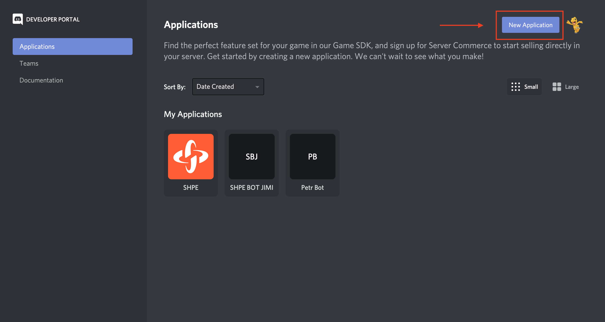
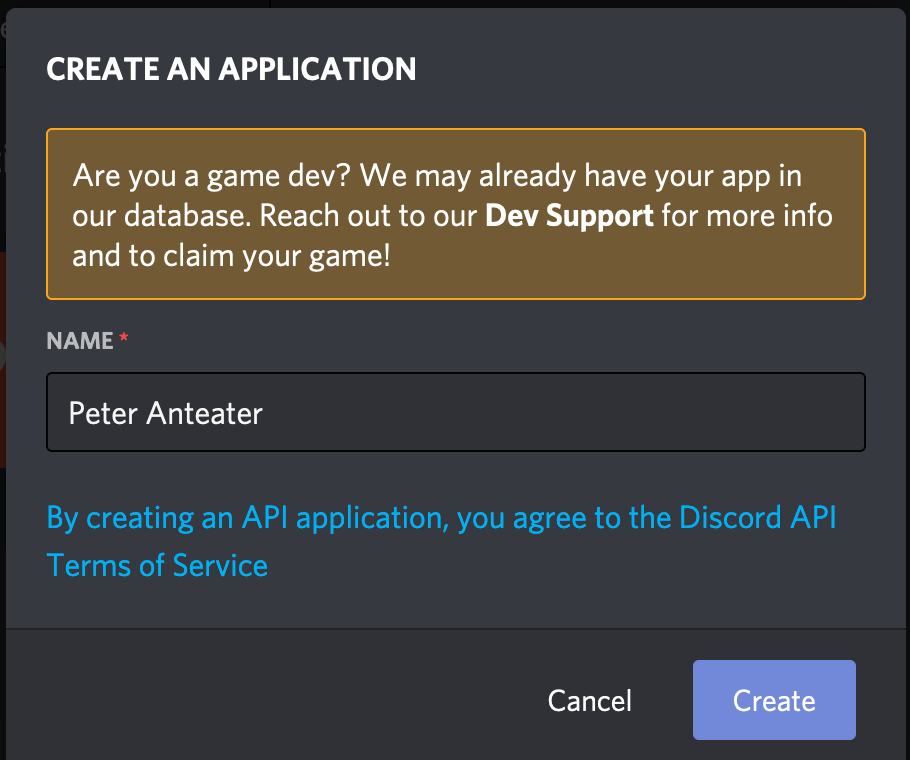

# Discord API Setup
## Instructions
* Create a [Discord Developer Account](https://discord.com/developers/applications) and create a bot
  * After logging in , hit on the New Application button on the top right and name your bot.
  *  
  * Enter your own bot name and hit Create
  * 
  * Take note of the **Application ID**, we will use this later.
  * Head over to Bot on the menu and hit Add Bot
  * 
  * Click to reaveal token, save this key. **DONT SHARE THIS KEY**
  * 
