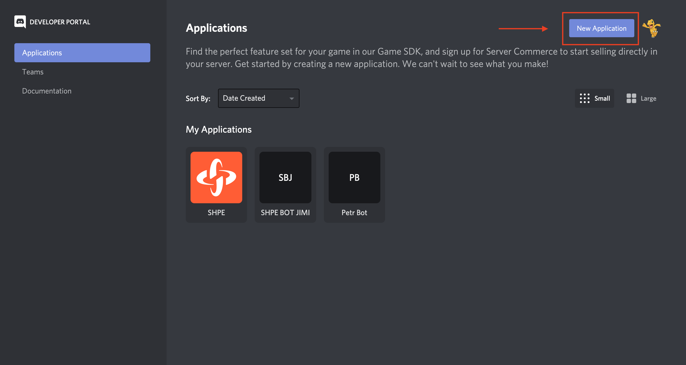
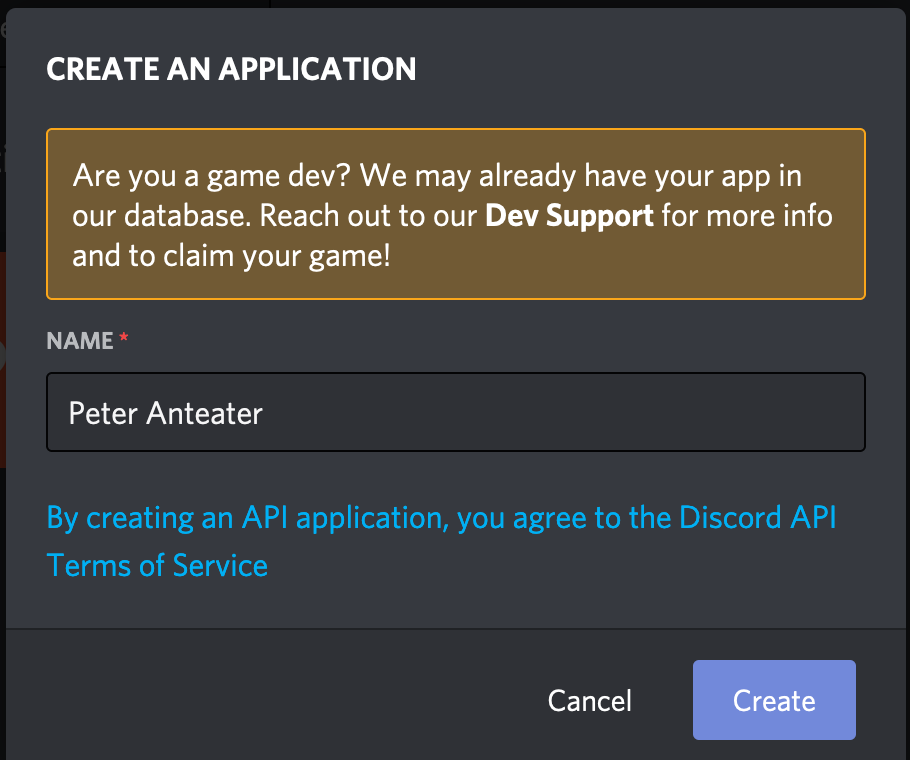

# Discord Bot Starter Code
This starter code is meant for anyone to learn how to start/create a Discord bot. For any questions contact author.
## Requirements
* Create a [Discord Developer Account](https://discord.com/developers/applications) and create a bot
  * After logging in , hit on the New Application button on the top right and name your bot.
  
  * Enter your own bot name and hit Create
  
* [NodeJS](https://nodejs.org/en/) v8 or newer. LTS preferred
* (Optional) Create a Heroku Account to host your bot.

## Installation
1. [Fork this repository](https://github.com/SHPE-at-UCI/discord-bot-starterpack/fork)

### On your terminal
2. Clone your Fork on to your local machine
``` bash
git clone https://github.com/your-github-username/discord-bot-starterpack.git
```
3. Change directory and install dependecies
``` bash
cd discord-bot-starterpack
npm install
```
4. Edit the .env file with **your own DISCORD_API key**
``` bash
DISCORD_KEY = FDAFDASFSDFSAFDAS
```
5. Run application
``` javascript
node index.js
```
## Author
[JimmyJuarez10](https://github.com/JimmyJuarez10)

## License
Copyright 2021 SHPE-at-UCI

Permission is hereby granted, free of charge, to any person obtaining a copy of this software and associated documentation files (the "Software"), to deal in the Software without restriction, including without limitation the rights to use, copy, modify, merge, publish, distribute, sublicense, and/or sell copies of the Software, and to permit persons to whom the Software is furnished to do so, subject to the following conditions:

The above copyright notice and this permission notice shall be included in all copies or substantial portions of the Software.

THE SOFTWARE IS PROVIDED "AS IS", WITHOUT WARRANTY OF ANY KIND, EXPRESS OR IMPLIED, INCLUDING BUT NOT LIMITED TO THE WARRANTIES OF MERCHANTABILITY, FITNESS FOR A PARTICULAR PURPOSE AND NONINFRINGEMENT. IN NO EVENT SHALL THE AUTHORS OR COPYRIGHT HOLDERS BE LIABLE FOR ANY CLAIM, DAMAGES OR OTHER LIABILITY, WHETHER IN AN ACTION OF CONTRACT, TORT OR OTHERWISE, ARISING FROM, OUT OF OR IN CONNECTION WITH THE SOFTWARE OR THE USE OR OTHER DEALINGS IN THE SOFTWARE.
